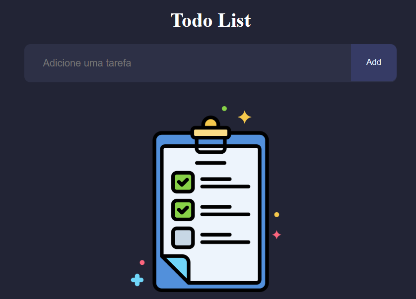
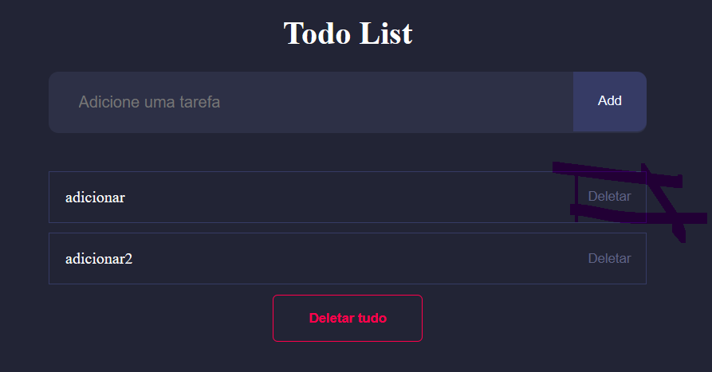

# To DO List 

Web Site em desenvolvimento.

## Índice

- [Descrição do projeto](#descrição-do-projeto)
- [Visão geral](#Visão-Geral)
- [Tecnologias](#tecnologias)
- [Desenvolvedor](#desenvolvedor-do-projeto)

## Descrição do projeto

O projeto é idealizado como uma lista de Tarefas, em que o usuário pode registrar suas tarefas, as marcar como feitas ou não e após isso pode deletar elas.

## Visão Geral

### Adicionar Tarefa

Para adicionar uma nova função no sistema, é apenas preciso digitar a tarefa no campo de texto e apertar no botão "ADD". 
Após isso, a tarefa será adicionada.

### Deletar tarefa

Ao clicar no botão "deletar" na linha da tarefa, a tarefa em questão será deletada da lista.

### Deletar todas as tarefas

Ao clicar no botão "Deletar Tudo", a lista inteira será deletada.

## Tecnologias

As tecnologias utilizadas no desenvolvimento e suporte deste projeto são:

- [NodeJS](https://nodejs.org/en)
- [CSS](https://developer.mozilla.org/pt-BR/docs/Web/CSS)
- [JavaScript](https://developer.mozilla.org/pt-BR/docs/web/javascript/guide/introduction)
- [HTML](https://developer.mozilla.org/pt-BR/docs/Web/HTML)
- [ViteJS](https://vitejs.dev/guide/)
- [ReactJS](https://pt-br.legacy.reactjs.org/)
  
## Desenvolvedor do projeto

O criador e desenvolvedor do projeto é:

- GABRIEL OLIVEIRA DE MATOS
E-mail: gabriel.oli.matos321@hotmail.com
Número: (41) 9 9777-0140
